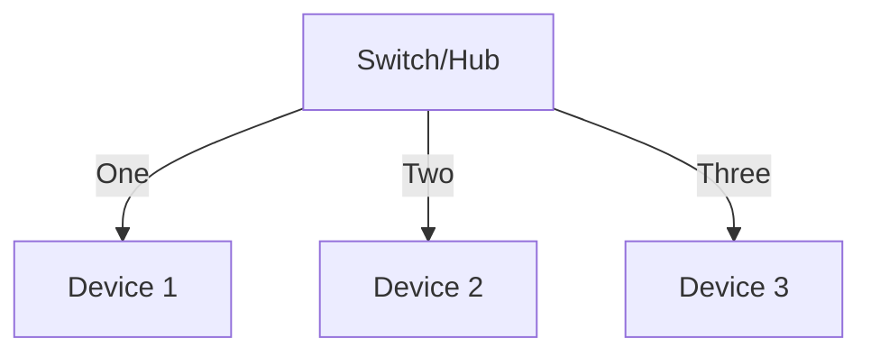

## **LAN:**

Lan full form is local area network. It connects computer together within a small area like campus/building.

## LAN Topologies:
## 1. STAR Topology:



- In this topology the devices(node) are connected individually to a central device like a switch or a hub.
- This is commonly used and is quite easy to install.
- The disadvantage is that as more cabling and networking equipment is needed so more maintenance cost and also if the central device like the hub or the switch fails the devices will no longer send or receive data and the whole network will go down.
 ##
 ## 2. Bus Topology
```mermaid

flowchart TD

C["Cable (e.g., Ethernet Hub)"]

D[Device 1] --> C
E[Device 2] --> C
F[Device 3] --> C
G[Device 4] --> C

 ```

- This type of topology relies on one cable only.
 - It is easy to install but it can get slowed for example if all the devices are requesting data at the same time.
 - Also if the cable breaks data won't be transmitted, Basically the whole network goes down.
 ##
 ## 3. Ring Topology:
 ```mermaid
flowchart TD
A[Device 1] <--> B[Device 2]
B <--> C[Device 3]
C <--> D[Device 4]
D <--> A

 ```
- In this type each device is connected to the other device which forms a circular pathway for the data to travel.
- Gives good performance for small to medium networks
 - If one device or the cable breaks the entire network goes down.

 ##
 ## 4. Switch:
 - It is used in LAN
 - It's function is to connected multiple devices in the same network & It does no IP assignment.
 ##
 ## 5. Router
 - Used in LAN to connect to the internet.
 - It function is to connect the multiple networks
 - It assigns IPs to devices using DHCP.
   ##
   ## 6.IP address:
   It consist of 4 octets.
             
    For example in this IP Address:   192.168.1.1
              
|--|192| 168 |1|1|
|--|--|--|--|--|
|Octed:| 1 |2 |3|4|
  
   
   - Network address is the actual network address , Host address is used to specify a specific device within the network and Default gateway is what connects local network to another network.
   -  Network Address: **192.168.1.0**
- Host Address: **192.168.1.150**
- Default Gateway (Router): **192.168.1.254**
##
## 7. ARP Request:
- A device has two identifiers MAC & IP address.
- ARP allows to identify each other on a network.
- It associates MAC with IP address
- ARP cache is that the device stores the mapping done for the future use
``` mermaid
flowchart TD
A[Host A wants to communicate with Host B]
B[Host A checks ARP table for Host B's MAC address]
C{MAC address found?}
D[Use the MAC address to send the packet]
E[Send ARP Request as broadcast]
F[Host B receives ARP Request]
G[Host B sends ARP Reply with its MAC address]
H[Host A updates ARP table]
I[Send the packet to Host B]

A --> B --> C
C -- Yes --> D --> I
C -- No --> E --> F --> G --> H --> I

```
##
## 8. DHCP:
- Dynamic host configuration protocol.
- IP can be assigned automatically using DHCP
``` mermaid
flowchart TD
A[Device connects to network]
B[DHCP Discover - broadcast]
C[DHCP Server receives Discover]
D[DHCP Offer - server responds]
E[DHCP Request - device confirms]
F[DHCP ACK - server assigns IP]
G[IP address assigned to device]
A --> B --> C --> D --> E --> F --> G
 ```

